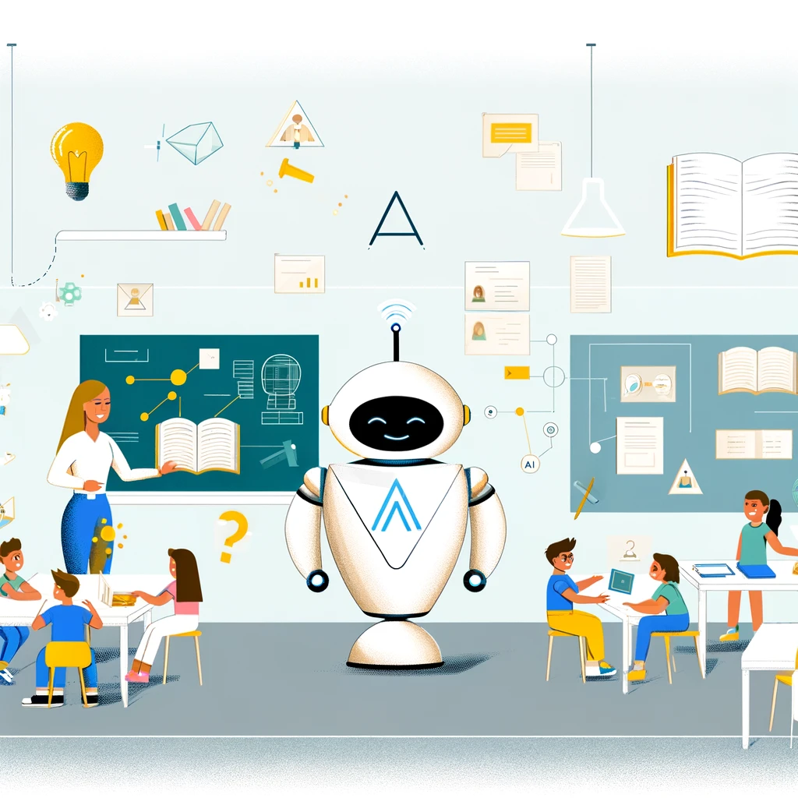

## Willkommen bei AIA - Education 👋

Ja, wir treiben die Bildungsrevolution mit Technologie voran. Seit unserer Gründung haben wir es uns zur Aufgabe gemacht, mithilfe künstlicher Intelligenz gegen den Lehrermangel in Deutschland vorzugehen. Unsere Reise begann mit der Vision, Bildung auf ein neues Niveau zu heben, und das **AI.STARTUP.HUB Ideation Program** hat uns auf diesem Weg entscheidend unterstützt.

### 📚 Eine neue Ära der Bildung

Die Bildungskrise in Deutschland stellt uns vor große Herausforderungen: Ein akuter Lehrermangel und signifikante Lerndefizite unter Schülern. AIA - Education möchte mit innovativen Lösungen diesen Problemen entgegentreten:

- **Künstliche Intelligenz** zur Unterstützung von Lehrkräften, indem Routineaufgaben automatisiert und personalisiertes Unterrichtsmaterial zur Verfügung gestellt wird
- **Engagement und Innovation** durch unser Start-up, unterstützt durch das AI.STARTUP.HUB, Mentor*innen und ein starkes Netzwerk
- **Aktive Beteiligung** von Lehrkräften und Bildungsexperten, um unsere Tools in der Praxis zu testen und zu verbessern

### 🤖 Technologie trifft Pädagogik

Wir sind fest davon überzeugt, dass der Schlüssel zur Überwindung des Lehrermangels und zur Verbesserung der Bildungsqualität in der intelligenten Nutzung von Technologie liegt. Unsere Repositories enthalten:

- Die **AIA-Plattform**: Eine innovative Lösung zur Entlastung von Lehrkräften durch automatisierte Korrektur und Erstellung individueller Lernmaterialien
- **Spezialisierte Services**: Für maßgeschneiderte Aufgaben wie bestimmte APIs/Modelle, die den Kern unserer Anwendung unterstützen

### 👨‍🏫👩‍🏫 Ein Aufruf zur Mitwirkung

Wir stehen noch am Anfang unserer Reise und suchen nach motivierten Lehrkräften und Bildungsexperten, die uns dabei helfen, das deutsche Bildungssystem zu revolutionieren. Wenn Sie Interesse haben, unsere Technologie in der Praxis zu testen oder Teil unseres Teams zu werden, kontaktieren Sie uns bitte unter info@aia-edu.de.

### 🌈 Die Vorteile von AIA

Unser Ziel ist es, Lehrkräften zu helfen, Zeit zu sparen und gleichzeitig eine faire und individuelle Bewertung der Schülerleistungen zu ermöglichen. Mit AIA profitieren Sie von:

- **Zeitersparnis** durch Automatisierung von Korrekturen
- **Einfacher Bedienung** unserer plattformübergreifenden Lösungen
- **Faire Bewertung** durch fortschrittliche KI-Modelle
- **DSGVO-konformer** Software
- **Umfassender Korrektur** von Grammatik, Rechtschreibung und Inhalt

 
	
"Mehr über unsere Technologie und Vision erfahren"

	 
	<ul>
		<li>Unsere Entwicklung basiert auf fortschrittlicher KI, die speziell für den Bildungsbereich angepasst ist.</li>
		<li>Wir arbeiten interdisziplinär und integrieren Expertise aus Pädagogik, Technologie und Design, um die besten Lösungen zu schaffen.</li>
		<li>Die Feedbacks von Lehrkräften sind uns besonders wichtig, um unsere Produkte kontinuierlich zu verbessern und an die Bedürfnisse anzupassen.</li>
	</ul>

